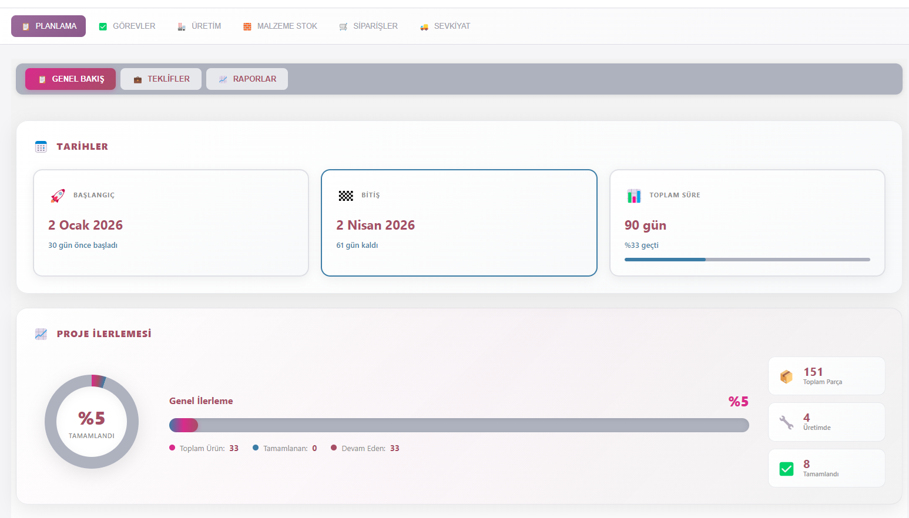

# 🏗️ Monolith - Üretim Takip Yönetim Sistemi

> Modern, kullanıcı dostu ve kapsamlı bir üretim takip ve yönetim sistemi


---

## 📋 Proje Hakkında

Monolith, üretim süreçlerini dijitalleştirmek ve verimliliği artırmak amacıyla geliştirdiğim **modern bir masaüstü uygulaması**dır. Electron, React ve Firebase teknolojilerini kullanarak, gerçek zamanlı üretim takibi ve yönetimi sağlayan kapsamlı bir çözüm sunuyor.

### 🎯 Amaç

Üretim firmalarının iş süreçlerini dijitalleştirerek:
- Gerçek zamanlı üretim takibi
- Malzeme ve stok yönetimi
- Raporlama ve analiz
- Çoklu kullanıcı desteği ve rol yönetimi
sağlamak.

---

## 🚀 Temel Özellikler

### 📊 Üretim Yönetimi
- **Gerçek zamanlı üretim takibi**
- İş emirleri ve görev yönetimi
- Süreç aşamaları görselleştirmesi
- Performans metrikleri ve raporlama

### ☁️ Bulut Entegrasyonu
- **Firebase Firestore** - Gerçek zamanlı veritabanı
- **Firebase Storage** - Dosya ve görsel yönetimi
- **Firebase Authentication** - Güvenli kimlik doğrulama
- Çoklu cihaz senkronizasyonu

### 🔐 Kimlik Doğrulama ve Güvenlik
- **Azure Active Directory** entegrasyonu
- **Multi-factor Authentication** desteği
- Rol tabanlı erişim kontrolü (RBAC)
- Kullanıcı ve yetki yönetimi

### 📁 Dosya Yönetimi
- **OneDrive** entegrasyonu
- Otomatik dosya senkronizasyonu
- Bulut üzerinde döküman saklama
- Microsoft Graph API kullanımı

### 📄 Raporlama
- **Excel export** (XLSX)
- **PDF oluşturma** (jsPDF)
- Özelleştirilebilir şablonlar
- Otomatik rapor üretimi

### 📲 QR Kod Sistemi
- QR kod üretimi
- Barkod okuma
- Ürün takibi
- Envanter yönetimi

### 🔄 Otomatik Güncelleme
- **electron-updater** ile otomatik update
- Versiyon kontrolü
- Kullanıcıya bildirim sistemi
- Kesintisiz güncelleme

---

## 🛠️ Kullanılan Teknolojiler

### Frontend
```
├── React 18.3.1           # UI Framework
├── TypeScript 5.6.2       # Type Safety
├── Vite 6.0.1            # Build Tool & Dev Server
└── CSS Modules           # Styling
```

### Backend & Services
```
├── Electron 28.0.0       # Desktop Framework
├── Node.js              # Runtime
└── Firebase SDK         # Cloud Services
```

### Veritabanı & Storage
```
├── Firebase Firestore   # NoSQL Database
├── Firebase Storage     # File Storage
└── LocalStorage        # Offline Data
```

### Authentication & Integration
```
├── Firebase Auth                # Email/Password Auth
├── Azure AD (MSAL Browser)     # Enterprise SSO
├── Google Auth Provider        # Social Login
└── Microsoft Graph API         # OneDrive Integration
```

### Kütüphaneler & Tools
```
├── jsPDF                # PDF Generation
├── xlsx                 # Excel Export
├── qrcode               # QR Code Generator
├── electron-builder     # App Packaging
├── electron-updater     # Auto Updates
└── concurrently        # Dev Scripts
```

---

## 🏗️ Mimari Tasarım

### Katmanlı Mimari

```
┌─────────────────────────────────────────┐
│          Presentation Layer             │
│  (React Components, UI/UX)              │
├─────────────────────────────────────────┤
│         Application Layer               │
│  (Business Logic, Services)             │
├─────────────────────────────────────────┤
│         Data Access Layer               │
│  (Firebase, LocalStorage, OneDrive)     │
├─────────────────────────────────────────┤
│       Infrastructure Layer              │
│  (Electron, Node.js, OS APIs)           │
└─────────────────────────────────────────┘
```

### Modüler Yapı

```
src/
├── components/        # Reusable UI Components
├── screens/          # Page Components
├── services/         # Business Logic
├── utils/           # Helper Functions
├── contexts/        # React Context Providers
├── hooks/           # Custom React Hooks
└── shared/          # Types & Constants
```

---

## 💡 Teknik Zorluklar ve Çözümler

### 1. Offline-First Yaklaşım
**Sorun**: İnternet bağlantısı kesintilerinde veri kaybı  
**Çözüm**: 
- LocalStorage cache mekanizması
- Offline queue sistemi
- Otomatik senkronizasyon

### 2. Gerçek Zamanlı Senkronizasyon
**Sorun**: Çoklu kullanıcı veri tutarlılığı  
**Çözüm**:
- Firebase realtime listeners
- Optimistic UI updates
- Conflict resolution stratejileri

### 3. Desktop ve Web Uyumluluğu
**Sorun**: Electron ve web platform farklılıkları  
**Çözüm**:
- Preload script güvenlik katmanı
- IPC (Inter-Process Communication) köprüleri
- Platform-agnostic kod yazımı

### 4. Performans Optimizasyonu
**Sorun**: Büyük veri setlerinde yavaşlama  
**Çözüm**:
- React.memo ve useMemo optimizasyonları
- Lazy loading ve code splitting
- Virtual scrolling (windowing)
- Debouncing ve throttling
## 📸 Ekran Görüntüleri

### 🏠 Planlama Dashboard
Ana kontrol paneli - Proje ilerleme takibi ve genel bakış



<details>
<summary>📋 <strong>Dashboard Özellikleri</strong></summary>

#### Üst Panel - Tarih ve Süre Yönetimi
- 📅 **Başlangıç Tarihi**: 23.01.2026
- 📅 **Bitiş Tarihi**: 24.03.2026 (Mavi vurgu)
- ⏱️ **Toplam Süre**: 90 gün
- ⏳ **Kalan Süre**: 61 gün (Geri sayım)

#### İlerleme Göstergeleri
- 📊 **Tamamlanma**: %5 (İlerleme çubuğu)
- 🎯 **Durum**: Devam Ediyor (Pembe/Kırmızı badge)

#### İstatistik Kartları (3-Kolon Grid)
**Toplam Parçalar**
- 🔢 151 adet
- Toplam parça sayısı

**Üretimdeki Parçalar**
- 🏭 4 adet (Kırmızı/Pembe)
- Aktif üretim

**Tamamlanan Parçalar**
- ✅ 8 adet (Yeşil)
- Bitmiş işler

#### Alt Panel - Ürün Bilgileri
- 📦 **Toplam Ürün**: 33
- 🔄 **Devam Eden**: 33 (Tümü aktif)

</details>

---

### 🎨 UI/UX Tasarım Detayları

#### Tab Navigasyon Sistemi
Modern, kullanıcı dostu tab menü:

```
┌────────────────────────────────────────────────────────────────┐
│ 📋 PLANLAMA │ ✅ GÖREVLER │ 🏭 ÜRETİM │ 📦 MALZEME │ 📝 SİPARİŞ │
└────────────────────────────────────────────────────────────────┘
```

#### Renk Paleti
- 🟣 **Mor/Pembe Gradient**: Header, aktif butonlar
- 🔵 **Mavi**: Önemli tarihler (bitiş tarihi vurgusu)
- 🟢 **Yeşil**: Tamamlanan işlemler
- 🔴 **Kırmızı/Pembe**: Devam eden işler
- ⚪ **Gri/Beyaz**: Nötr bilgiler, arka plan

#### Komponent Yapısı
- **Material Design Cards**: Gölgeli, yükseltilmiş kartlar
- **Progress Bars**: Animasyonlu %5 ilerleme çubuğu
- **Badges**: Renkli durum göstergeleri
- **Grid Layout**: Responsive 3-kolon yapı
- **Icons**: Emoji bazlı görsel iyileştirmeler

---

### 💡 Diğer Modül Önizlemeleri

<table>
<tr>
<td width="50%">

#### 🏭 Üretim Takip Modülü
**Kanban Board Sistemi**
- Sürükle-bırak iş emirleri
- 3 durum kolonu: Bekliyor / Üretimde / Tamamlandı
- QR kod ile parça takibi
- Gerçek zamanlı durum güncellemesi
- Öncelik ve termin uyarıları

**Özellikler:**
- 📱 QR okuma
- 🔄 Sürükle-bırak
- ⚡ Anlık güncelleme
- 🎯 Durum göstergesi

</td>
<td width="50%">

#### 📦 Malzeme Stok Yönetimi
**Envanter Takip Sistemi**
- Malzeme listesi ve stok seviyeleri
- Minimum stok uyarıları (🔴 Kırmızı)
- Tedarikçi bilgileri
- Fiyat geçmişi ve trend analizi
- Excel export

**Özellikler:**
- 📊 Stok grafikleri
- ⚠️ Kritik seviye uyarısı
- 💰 Fiyat takibi
- 📥 Toplu import/export

</td>
</tr>
<tr>
<td width="50%">

#### 📝 Sipariş Yönetimi
**Sipariş Takip Paneli**
- Yeni sipariş oluşturma
- Durum takibi (Bekliyor → Hazırlanıyor → Sevk)
- Müşteri bilgileri
- Fatura entegrasyonu
- Teslimat tarihi yönetimi

**İş Akışı:**
1. ➕ Sipariş Gir
2. 📋 Onay Bekle
3. 🏭 Üretime Gönder
4. ✅ Tamamla

</td>
<td width="50%">

#### 🚚 Sevkiyat Modülü
**Lojistik Yönetim**
- Sevk planlaması
- İrsaliye oluşturma (PDF)
- Kargo takip numarası
- Teslimat raporları
- Nakliye firması entegrasyonu

**Raporlar:**
- 📄 İrsaliye (PDF)
- 📦 Paket listesi
- 🚚 Sevk özeti
- 📊 Teslimat analizi

</td>
</tr>
</table>

---

### 📊 Raporlama ve Analiz

#### Rapor Tipleri
- 📈 **Excel Reports**: Detaylı veri exportu (XLSX)
- 📄 **PDF Documents**: İrsaliye, fatura, özet raporlar
- 📊 **Charts & Graphs**: İlerleme ve performans grafikleri
- 📋 **Custom Templates**: Özelleştirilebilir rapor şablonları

#### Filtreler ve Seçenekler
```
📅 Tarih Aralığı    |  🏷️ Kategori  |  👤 Kullanıcı  |  📊 Durum
```

---

### 🎯 Detaylı Ekran Görüntüleri

Tüm modüllerin detaylı açıklamaları ve özellikleri için:  
👉 **[SCREENSHOTS.md](SCREENSHOTS.md)** 📸

---

## 🎓 Öğrenilen Beceriler

Bu projede kazandığım temel beceriler:

### Frontend Development
- ✅ Modern React patterns (Hooks, Context, Custom Hooks)
- ✅ TypeScript ile tip güvenli kod
- ✅ Component-based architecture
- ✅ State management strategies
- ✅ Performance optimization

### Backend & Cloud
- ✅ Firebase Firestore queries ve security rules
- ✅ Cloud storage yönetimi
- ✅ Serverless architecture
- ✅ Real-time data synchronization

### Desktop Development
- ✅ Electron framework
- ✅ IPC communication
- ✅ Auto-update mechanisms
- ✅ Cross-platform packaging

### DevOps & Tools
- ✅ Git version control
- ✅ CI/CD pipeline konseptleri
- ✅ Build ve deployment süreçleri
- ✅ Debugging ve profiling

### Integration & APIs
- ✅ RESTful API consumption
- ✅ OAuth 2.0 authentication
- ✅ Microsoft Graph API
- ✅ Third-party service integrations

---

## 📦 Deployment

Proje, aşağıdaki deployment stratejisi ile dağıtılmıştır:

### Build Process
```bash
1. TypeScript compilation
2. Vite production build
3. Electron packaging
4. NSIS installer creation
```

### Distribution
- Windows 64-bit installer (.exe)
- Otomatik güncelleme sunucusu
- Sürüm yönetimi ve release notes

---

## 🔒 Güvenlik

Projede uygulanan güvenlik önlemleri:

- ✅ Environment variables ile hassas bilgi yönetimi
- ✅ Firebase security rules
- ✅ Azure AD enterprise authentication
- ✅ HTTPS only communication
- ✅ XSS ve CSRF koruması
- ✅ Input validation ve sanitization
- ✅ Rol tabanlı erişim kontrolü

---

## 📈 Proje Metrikleri

### Kod İstatistikleri
- **Toplam Satır**: ~60,000+ lines
- **Component Sayısı**: 40+ React components
- **Service Modülleri**: 15+ service modules
- **Utility Functions**: 20+ helper utilities

### Performans
- **İlk Yüklenme**: < 3 saniye
- **Ortalama Sayfa Geçişi**: < 500ms
- **Bundle Size**: ~2.5MB (gzipped)

---

## 🎯 Gelecek Geliştirmeler

Proje kapsamında planlanmış ama tamamlanmamış özellikler:

- [ ] Mobile app (React Native)
- [ ] Dark mode support
- [ ] Advanced analytics dashboard
- [ ] Machine learning predictions
- [ ] REST API backend
- [ ] Multi-language support (i18n)

---

## 📄 Lisans

**MIT License - © 2026 Ozan Sert**


### İletişim
- 💼 **GitHub**: [@ozansert58](https://github.com/ozansert58)
- 🔗 **LinkedIn**: [Ozan Sert](https://www.linkedin.com/in/ozan-sert-261857228/)
- 📧 **Email**: ozansert93@hotmail.com

---

## 🙏 Teşekkürler

Bu projeyi ziyaret ettiğiniz için teşekkür ederim. Gerçek uygulamayı görmek veya benzer bir proje geliştirmek isterseniz, lütfen benimle iletişime geçin.

---

<div align="center">

### 🏗️ Monolith Production Manager

**Enterprise-Level Desktop Application** | **Modern Tech Stack** | **Real-time Sync**

[](https://github.com/ozansert58)
[](https://electronjs.org)
[](https://reactjs.org)
[](https://firebase.google.com)
[](https://www.typescriptlang.org)

*Geliştirme: 2025-2026 | Versiyon: 1.0.
